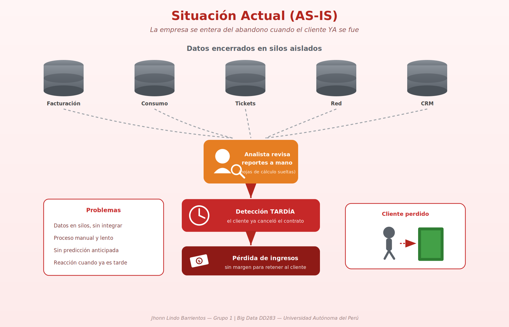
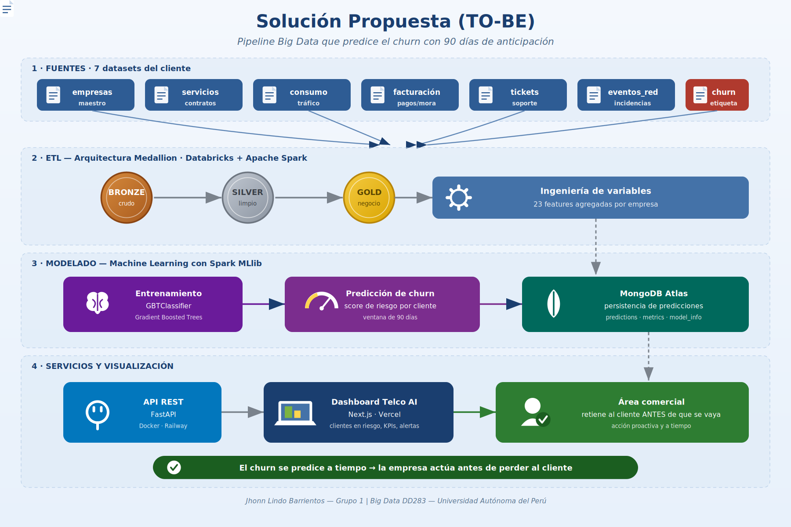

# Predicción de Churn B2B en Telecomunicaciones

Proyecto de Big Data (DD283) — Universidad Autónoma del Perú

## Objetivo

Predecir el abandono (churn) de clientes empresariales con **90 días de anticipación**, utilizando Big Data y Machine Learning, para que las áreas comerciales puedan ejecutar acciones de retención de forma proactiva.

## Integrantes

- Asto Arotinco Ana (0000-0002-2195-0764)
- Flores Condeña Javier (0000-0003-2800-5084)
- Lindo Barrientos Jhonn Viequier (0000-0001-6025-7332)
- Tito Paredes Arian (0009-0002-5717-8099)
- Quispe Poma Cristian (0009-0008-6566-3741)

## Enlaces del proyecto

| Recurso | Enlace |
|---|---|
| Dashboard en producción | https://v0-churntelco2b2.vercel.app |
| Video de demostración | https://drive.google.com/file/d/1SbeNbehBP5sFfGkmTlNcg1f9zYW2vYNi/view |
| Presentación final | https://www.canva.com/design/DAHQPKtfiLA/nGreNzr4fD-P_MBnThFVHg/edit |

---

## Arquitectura

El proyecto evoluciona de un proceso manual y reactivo (as-is) a un pipeline Big Data que predice el churn de forma anticipada (to-be).

**Situación actual (as-is):**



**Solución propuesta (to-be):**



El pipeline sigue una **arquitectura Medallion** (Bronze → Silver → Gold) sobre Apache Spark en Databricks, entrena un modelo **Gradient Boosted Trees** con Spark MLlib, persiste las predicciones en **MongoDB Atlas**, las expone mediante una **API REST en FastAPI** y las visualiza en un dashboard **Next.js** desplegado en Vercel.

---

## Tecnologías

- **Procesamiento:** Python, Pandas, PySpark, Databricks Community Edition
- **Machine Learning:** Spark MLlib (GBTClassifier), Scikit-Learn
- **Persistencia:** MongoDB Atlas, Parquet
- **Backend:** FastAPI, Docker, Railway
- **Frontend:** Next.js, desplegado en Vercel

---

## Estructura del repositorio

```
├── data/
│   ├── raw/                 # 7 archivos CSV de origen
│   └── processed/           # dataset Gold (Parquet y CSV)
├── notebooks/
│   ├── Semana02-Ingesta/    # 01_ingestion
│   ├── Semana03-ETL/        # 02_bronze, 03_silver, 04_gold
│   ├── Semana04-EDA/        # 05_eda
│   ├── Semana05-Feature/    # feature_engineering
│   └── Semana06-ML/         # 07_model_training
├── src/
│   ├── churn_backend/       # API REST (FastAPI)
│   └── churntelecomb2b/     # Dashboard (Next.js)
├── docs/
│   ├── arquitectura/        # diagramas as-is y to-be
│   └── semana_01 … semana_08/   # documentación por etapa
├── requirements.txt         # dependencias del pipeline de datos/ML
└── README.md
```

---

## Instalación y ejecución

### 1. Pipeline de datos y Machine Learning (notebooks)

Requisitos: Python 3.10 o superior.

```bash
# Clonar el repositorio
git clone https://github.com/jlindo-cloud/bigdata-g1-churn-telecom-b2b.git
cd bigdata-g1-churn-telecom-b2b

# Instalar dependencias
pip install -r requirements.txt

# Abrir los notebooks
jupyter notebook
```

Ejecutar los notebooks en orden: `Semana02-Ingesta` → `Semana03-ETL` (bronze, silver, gold) → `Semana04-EDA` → `Semana05-Feature` → `Semana06-ML`.

> Los notebooks fueron desarrollados en Databricks Community Edition. Para reproducirlos en Databricks, importarlos al workspace y ejecutarlos con un clúster activo.

### 2. Backend — API REST (FastAPI)

Requisitos: Python 3.10 o superior y una cadena de conexión a MongoDB Atlas.

```bash
cd src/churn_backend

# Instalar dependencias del backend
pip install -r requirements.txt

# Configurar variables de entorno (crear un archivo .env)
#   MONGODB_URI=<tu cadena de conexión a MongoDB Atlas>
#   SECRET_KEY=<clave para los tokens JWT>

# Levantar el servidor de desarrollo
uvicorn app:app --reload --port 8000
```

La API quedará disponible en `http://localhost:8000` y su documentación interactiva en `http://localhost:8000/docs`.

**Alternativa con Docker:**

```bash
cd src/churn_backend
docker build -t churn-backend .
docker run -p 8000:8000 --env-file .env churn-backend
```

### 3. Frontend — Dashboard (Next.js)

Requisitos: Node.js 18 o superior.

```bash
cd src/churntelecomb2b

# Instalar dependencias
npm install

# Configurar la URL de la API (crear un archivo .env.local)
#   NEXT_PUBLIC_API_URL=http://localhost:8000

# Levantar el servidor de desarrollo
npm run dev
```

El dashboard quedará disponible en `http://localhost:3000`.

Para compilar la versión de producción:

```bash
npm run build
npm run start
```

---

## Plan de Trabajo

### Semana 1: Definición del Problema
- **Objetivo**: Definir el problema de negocio, los objetivos y el alcance del proyecto.
- **Entregables**: Planteamiento del problema, objetivos SMART, alcance y cronograma.

### Semana 2: Diseño de Datos
- **Objetivo**: Identificar las fuentes de datos, construir el modelo relacional y definir el diccionario de datos.
- **Entregables**: Diccionario de datos, modelo relacional y fuentes documentadas.

### Semana 3: ETL y Calidad de Datos
- **Objetivo**: Implementar el proceso ETL, consolidar los datos y asegurar su calidad.
- **Entregables**: Documento del proceso ETL, informe de calidad de datos y dataset procesado y validado.

### Semana 4: Análisis Exploratorio de Datos (EDA)
- **Objetivo**: Descubrir patrones, relaciones y tendencias en los datos.
- **Entregables**: Notebook con análisis descriptivo, visualizaciones e identificación de variables relevantes.

### Semana 5: Feature Engineering
- **Objetivo**: Crear nuevas variables (features) que potencien el modelo predictivo.
- **Entregables**: Notebook de ingeniería de variables, descripción de las features y dataset final.

### Semana 6: Machine Learning
- **Objetivo**: Entrenar y evaluar modelos de Machine Learning para predecir el churn.
- **Entregables**: Notebook de entrenamiento, métricas de desempeño (Accuracy, Precision, Recall, ROC-AUC) y selección del modelo campeón.

### Semana 7: Dashboard y Visualización
- **Objetivo**: Construir un dashboard interactivo que visualice el riesgo de churn para las áreas comerciales.
- **Entregables**: Dashboard, capturas e instrucciones de uso.

### Semana 8: Informe Final y Presentación
- **Objetivo**: Documentar todo el proyecto, resultados y recomendaciones.
- **Entregables**: Informe final (PDF), presentación final (PPTX) y video de demostración del modelo y dashboard.
